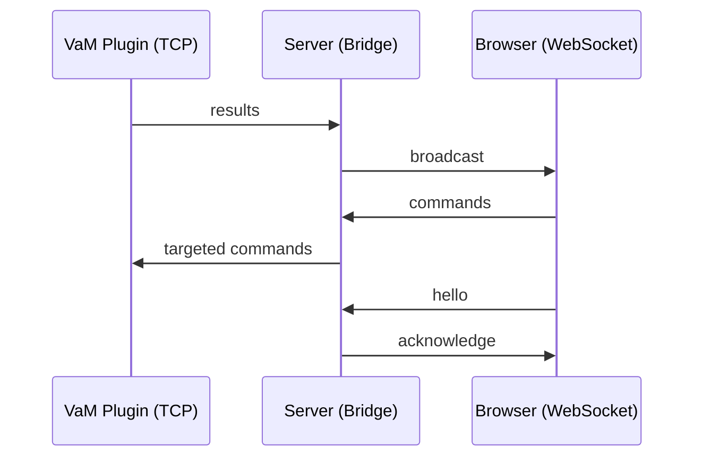

# WS_PROTOCOL.md
WebSocket Communication Protocol  
Browser ↔ Server (WS Layer)

---

## Overview
This document defines the **WebSocket protocol** used between browsers and the server.

Transport characteristics:

- Transport: WebSocket
- Encoding: UTF‑8 JSON
- Framing: Native WS frames
- Encryption: none
- Messages: always JSON objects
- Direction: bidirectional

The WS layer is responsible for:
- Browser identification
- Command forwarding to TCP plugins
- Receiving broadcasted results from TCP plugins
- Tracking browser identity and version

---

# 1. Connection Setup

## 1.1 Server Bind Address
```
HOST_WS = "127.0.0.1"
PORT_WS = 8765
```

Browsers must connect to:

```
ws://127.0.0.1:8765
```

---

# 2. Handshake Protocol

Immediately after connecting, the browser must send:

```
{
  "cmd": "hello",
  "id": "<browser-id>",
  "name": "<browser-name>",
  "version": "<client-version>"
}
```

Server responds with:

```
{
  "cmd": "acknowledge",
  "ack": "hello",
  "id": "<browser-id>",
  "name": "<browser-name>"
}
```

The server stores identity in:

```
ws_identities[ws] = { "id": ..., "name": ..., "version": ... }
```

---

# 3. Message Routing

## 3.1 Browser → Server → TCP (Targeted)
Browser messages are forwarded **only to the matching TCP plugin**.

Matching rule:
```
obj["id"]   == tcp_identities[conn]["id"]
obj["name"] == tcp_identities[conn]["name"]
```

Flow:
```
Browser → Server → Matching TCP Plugin
```

Example:
```
{
  "cmd": "set_controller",
  "id": "A1",
  "name": "Plugin",
  "controllers": [ ... ]
}
```

If no matching TCP client exists:
- Message is ignored
- No error is sent back

---

## 3.2 TCP → Server → Browser (Broadcast)
Any message received from a TCP plugin is **broadcast to all WebSocket clients**.

Flow:
```
TCP Plugin → Server → All Browsers
```

Example:
```
{
  "cmd": "pose_result",
  "data": { ... }
}
```

---

# 4. Browser Message Rules

## 4.1 Required Fields
Every browser message must contain:

```
"cmd": "<command>"
```

Optional fields:
- "id" (target plugin ID)
- "name" (target plugin name)
- "controllers" (controller updates)
- "morphs" (morph updates)
- "data" (generic payload)

Messages without `"cmd"` are ignored.

---

# 5. Broadcast Behavior

The server uses:

```
broadcast(message)
```

This sends the JSON message to **all connected browsers**.

If a browser fails to receive:
- It is removed from `ws_clients`
- The server continues broadcasting to others

---

# 6. Forwarding Behavior

Browser messages are forwarded using:

```
forward_to_tcp(obj)
```

This calls the registered callback:

```
set_forward_callback(cb)
```

If no callback is registered:
- A warning is printed
- Message is ignored

---

# 7. Error Handling

## 7.1 Browser Errors
- Invalid JSON → logged, ignored  
- Missing "cmd" → ignored  
- Failed send → browser removed from `ws_clients`

## 7.2 Server Errors
- Exceptions inside handlers are logged  
- WS connection is closed gracefully

---

# 8. Summary Diagram



---

# End of Document
