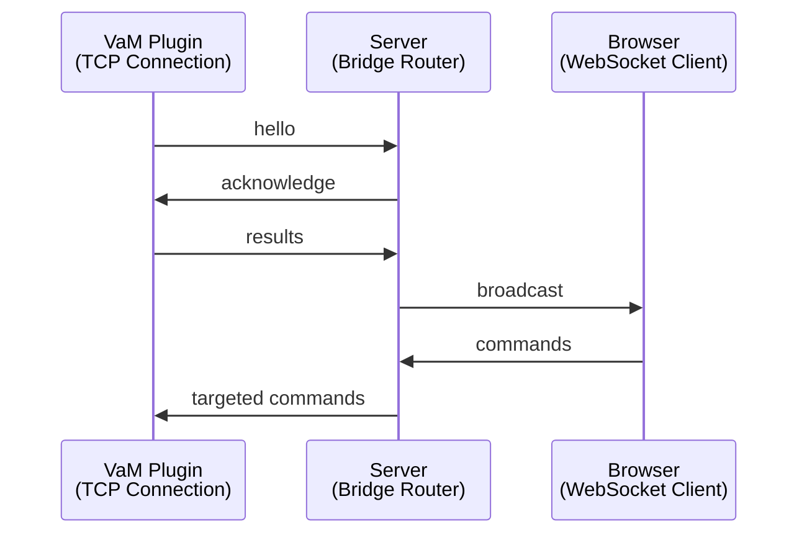

# ARCHITECTURE_OVERVIEW.md
System Architecture Overview  
TCP (VaM Plugins) ↔ Server ↔ WebSocket (Browsers)

---

## Purpose
This document provides a high‑level overview of the architecture of the communication system.  
It explains the components, their responsibilities, and how they interact at runtime.

---

# 1. System Components

The system consists of three major components:

```mermaid
flowchart LR
    V[VaM Plugin<br/>(TCP Client)] <--> S[Server<br/>(Bridge Hub)]
    S <----> B[Browser<br/>(WebSocket Client)]

    %% Labels for connections
    V ---|TCP| S
    S ---|WS| B
```

### 1.1 VaM Plugin (TCP Client)
- Connects via raw TCP  
- Sends results, morphs, controllers  
- Receives targeted commands  
- Identified by `"id"` and `"name"`

### 1.2 Server (Bridge Hub)
- Accepts TCP and WebSocket connections  
- Tracks identities of all clients  
- Normalizes commands  
- Routes messages between TCP and WS  
- Broadcasts plugin results to all browsers  
- Forwards browser commands to matching plugins  

### 1.3 Browser (WebSocket Client)
- Connects via WebSocket  
- Sends commands to specific plugins  
- Receives broadcasted results  
- Identified by `"id"`, `"name"`, `"version"`

---

# 2. Data Flow Overview

## 2.1 Plugin → Server → Browser (Broadcast)
Plugins send:
- pose results  
- morph results  
- controller results  
- any command ending in `_result`  

Server:
- receives TCP frame  
- decodes JSON  
- broadcasts to **all** browsers  

Flow:
```
Plugin → Server → All Browsers
```

---

## 2.2 Browser → Server → Plugin (Targeted)
Browsers send:
- controller commands  
- morph commands  
- read requests  
- plugin‑specific commands  

Server:
- matches `"id"` + `"name"`  
- forwards only to that plugin  

Flow:
```
Browser → Server → Matching Plugin
```

---

# 3. Identity Management

## 3.1 TCP Identity
Stored as:
```
tcp_identities[conn] = { "id": "<id>", "name": "<name>" }
```

Provided by plugin during handshake:
```
{ "cmd": "hello", "id": "...", "name": "..." }
```

## 3.2 WebSocket Identity
Stored as:
```
ws_identities[ws] = { "id": "<id>", "name": "<name>", "version": "<version>" }
```

Provided by browser during handshake:
```
{ "cmd": "hello", "id": "...", "name": "...", "version": "..." }
```

---

# 4. Command Normalization

The server adjusts commands before forwarding to TCP:

### Morphs
```
"morphs" → cmd = "read_all_morphs"
```

### Controllers
```
"controllers" → cmd = "read_all_controllers"
```

### Result commands
```
cmd ending in "_result" → unchanged
```

---

# 5. Controller Normalization

Before sending controller updates to TCP:

- IDs must be non‑empty  
- Rotation must include `"w"` (default 1.0)

Example:
```
{
  "id": "Chest",
  "rotation": { "x": 0, "y": 0, "z": 0, "w": 1.0 }
}
```

---

# 6. Server Responsibilities

## 6.1 TCP Layer
- Accept TCP connections  
- Read framed messages  
- Decode JSON  
- Track plugin identity  
- Forward messages to WebSocket layer  

## 6.2 WebSocket Layer
- Accept WS connections  
- Track browser identity  
- Forward commands to TCP layer  
- Broadcast plugin messages  

## 6.3 Routing Logic
```
if message from TCP:
    broadcast to all browsers

if message from browser:
    find matching plugin
    forward only to that plugin
```

---

# 7. Error Handling

## 7.1 TCP Errors
- Broken socket → remove plugin  
- Invalid JSON → ignore  
- Missing "cmd" → ignore  

## 7.2 WebSocket Errors
- Invalid JSON → ignore  
- Missing "cmd" → ignore  
- Failed send → remove browser  

---

# 8. Full Architecture Diagram



---

# 9. Summary

- The server is a **bridge** between TCP and WebSocket worlds  
- Plugins broadcast; browsers target  
- Identity matching ensures correct routing  
- Normalization ensures consistent command structure  
- The architecture is simple, robust, and extensible  

---

# End of Document
