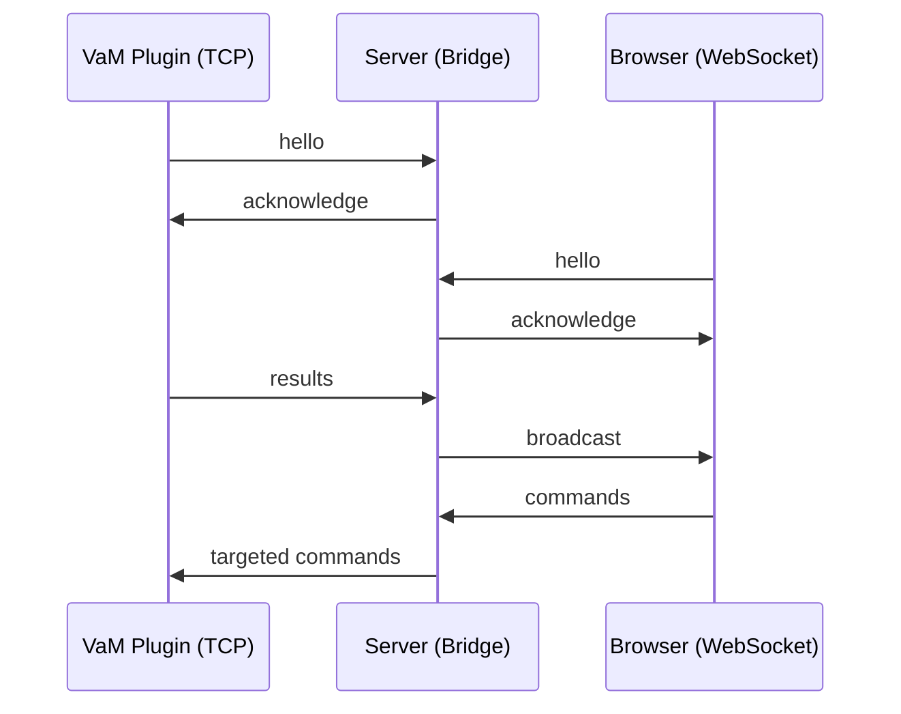

# COMMUNICATION_PROTOCOL.md
Unified Communication Protocol  
TCP (VaM Plugins) ↔ Server ↔ WebSocket (Browsers)

---

## Overview
This document defines the communication protocol used by the **server prototype** to bridge:

- **VaM plugins** (TCP clients)
- **Browser applications** (WebSocket clients)

The server acts as a **bidirectional router**, forwarding commands and results between both sides while maintaining identity, framing, and message normalization.

---

# 1. Transport Layers

## 1.1 TCP (VaM Plugins)
- Transport: Raw TCP
- Encoding: UTF‑8 JSON
- Framing: 4‑byte little‑endian length prefix
- Encryption: None
- Purpose:
  - Receive commands from browser
  - Send results back to browser
  - Provide plugin identity

### Frame Format
```
[4‑byte length][JSON payload]
```

### Example
```
00 00 00 2A  {"cmd":"hello","id":"A1","name":"Plugin"}
```

---

## 1.2 WebSocket (Browsers)
- Transport: WebSocket
- Encoding: UTF‑8 JSON
- Framing: Native WS frames
- Purpose:
  - Send commands to specific TCP clients
  - Receive broadcasted results
  - Provide browser identity

---

# 2. Identity & Handshake

## 2.1 TCP Plugin → Server
Plugins must send:

```
{
  "cmd": "hello",
  "id": "<string>",
  "name": "<string>"
}
```

Server responds with:

```
{
  "cmd": "acknowledge",
  "ack": "hello",
  "id": "<same>",
  "name": "<same>"
}
```

The server stores identity in:

```
tcp_identities[conn] = { "id": ..., "name": ... }
```

---

## 2.2 Browser → Server
Browsers must send:

```
{
  "cmd": "hello",
  "id": "<string>",
  "name": "<string>",
  "version": "<string>"
}
```

Server responds with:

```
{
  "cmd": "acknowledge",
  "ack": "hello",
  "id": "<same>",
  "name": "<same>"
}
```

The server stores identity in:

```
ws_identities[ws] = { "id": ..., "name": ..., "version": ... }
```

---

# 3. Message Routing

## 3.1 TCP → Browser (Broadcast)
Any message received from a TCP plugin is **broadcast to all WebSocket clients**.

Flow:
```
TCP plugin → server → all browsers
```

Example:
```
{
  "cmd": "pose_result",
  "data": { ... }
}
```

---

## 3.2 Browser → TCP (Targeted)
Browser messages are forwarded **only to the matching TCP client**.

Matching rule:
```
obj["id"]   == tcp_identities[conn]["id"]
obj["name"] == tcp_identities[conn]["name"]
```

Flow:
```
Browser → server → matching TCP plugin
```

Example:
```
{
  "cmd": "set_controller",
  "id": "A1",
  "name": "Plugin",
  "controllers": [ ... ]
}
```

---

# 4. Command Normalization (TCP Side)

## 4.1 Controller Normalization
Before sending controller updates to TCP:

- IDs must be non‑empty strings
- Rotation must include "w" (default 1.0)

Example normalized controller:
```
{
  "id": "Chest",
  "rotation": { "x": 0, "y": 0, "z": 0, "w": 1.0 }
}
```

---

## 4.2 Command Normalization Rules
If a message contains:

- "morphs" → normalized to "read_all_morphs"
- "controllers" → normalized to "read_all_controllers"
- Commands ending in "_result" are passed through unchanged

---

# 5. Acknowledgements

## 5.1 TCP Acknowledge
Used only for handshake:

```
{
  "cmd": "acknowledge",
  "id": "<id>",
  "name": "<name>",
  "ack": "<original cmd>"
}
```

---

# 6. Error Handling

## 6.1 TCP Errors
- Broken sockets → connection closed
- Invalid JSON → logged, ignored
- Missing "cmd" → ignored

## 6.2 WebSocket Errors
- Invalid JSON → logged, ignored
- Missing "cmd" → ignored
- Failed broadcast → WS client removed

---

# 7. Summary of Message Flow



---

# 8. Future Extensions
The protocol is designed to support:

- Encryption layers
- Authentication
- Multiple plugin types
- Binary payloads
- Compression
- Version negotiation

---

# End of Document
