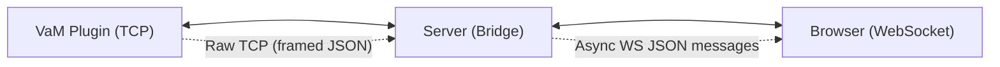
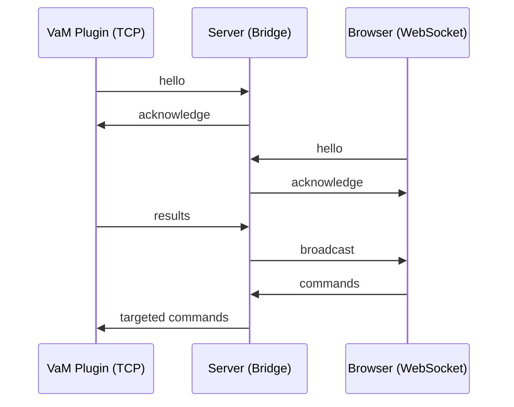

# MESSAGE_FLOW.md
Message Flow Overview  
TCP (VaM Plugins) ↔ Server ↔ WebSocket (Browsers)

---

## Purpose
This document describes **how messages move through the system**, from VaM plugins to browsers and back.  
It summarizes the runtime behavior of the server and the routing logic between TCP and WebSocket layers.

---

# 1. High‑Level Architecture



The server acts as a **bridge**:

- TCP plugin messages → **broadcast** to all browsers  
- Browser messages → **forwarded** only to the matching TCP plugin  

---

# 2. Startup Sequence

## 2.1 TCP Side
1. Plugin connects via TCP  
2. Plugin sends `hello`  
3. Server stores plugin identity  
4. Server sends `acknowledge`  

Flow:
```
Plugin → Server: hello
Server → Plugin: acknowledge
```

---

## 2.2 WebSocket Side
1. Browser connects via WebSocket  
2. Browser sends `hello`  
3. Server stores browser identity  
4. Server sends `acknowledge`  

Flow:
```
Browser → Server: hello
Server → Browser: acknowledge
```

---

# 3. Runtime Message Flow

## 3.1 Plugin → Server → All Browsers (Broadcast)
Plugins send:
- results  
- controller updates  
- morph updates  
- any other command ending in `_result`  

Server behavior:
- Accept message  
- Decode JSON  
- Broadcast to **all** connected browsers  

Flow:
```
Plugin → Server → All Browsers
```

Example:
```
{
  "cmd": "pose_result",
  "data": { ... }
}
```

---

## 3.2 Browser → Server → Matching Plugin (Targeted)
Browsers send:
- controller commands  
- morph commands  
- read requests  
- any plugin‑specific command  

Server behavior:
- Identify target plugin using `"id"` + `"name"`  
- Forward message **only** to that plugin  
- Ignore if no match exists  

Flow:
```
Browser → Server → Matching Plugin
```

Example:
```
{
  "cmd": "set_controller",
  "id": "A1",
  "name": "Plugin",
  "controllers": [ ... ]
}
```

---

# 4. Command Normalization (TCP Side)

Before forwarding to plugins, the server may normalize commands:

### Morphs
```
"morphs" → cmd = "read_all_morphs"
```

### Controllers
```
"controllers" → cmd = "read_all_controllers"
```

### Result commands
```
cmd ending in "_result" → unchanged
```

---

# 5. Controller Normalization

Before sending controller updates to TCP:

- IDs must be non‑empty strings  
- Rotation must include `"w"` (default 1.0)  

Example:
```
{
  "id": "Chest",
  "rotation": { "x": 0, "y": 0, "z": 0, "w": 1.0 }
}
```

---

# 6. Error Handling Flow

## 6.1 TCP Errors
- Broken socket → remove plugin  
- Invalid JSON → ignore  
- Missing `"cmd"` → ignore  

## 6.2 WebSocket Errors
- Invalid JSON → ignore  
- Missing `"cmd"` → ignore  
- Failed send → remove browser  

---

# 7. Full Message Flow Diagram


---

# 8. Summary

- **Plugins broadcast** to all browsers  
- **Browsers target** specific plugins  
- Server performs:
  - identity tracking  
  - command normalization  
  - controller normalization  
  - safe forwarding  
  - broadcast fan‑out  

This document describes the **runtime behavior** of the entire communication system.

---

# End of Document
