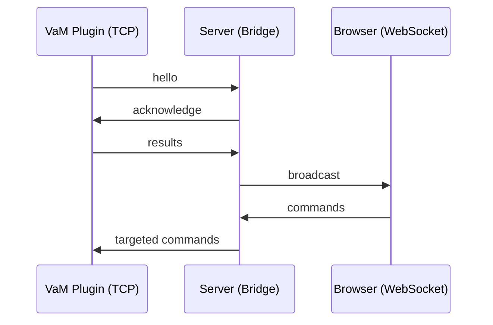

# TCP_PROTOCOL.md
TCP Communication Protocol  
VaM Plugin ↔ Server (TCP Layer)

---

## Overview
This document defines the **TCP protocol** used between the server and VaM plugins.

Transport characteristics:

- Transport: raw **TCP**
- Encoding: **UTF‑8 JSON**
- Framing: **4‑byte little‑endian length prefix**
- Encryption: none
- Messages: always JSON objects
- Direction: bidirectional

The TCP layer is responsible for:
- Plugin identification
- Length‑prefixed framing
- Command forwarding
- Result broadcasting
- Controller normalization
- Acknowledgements

---

# 1. Connection setup

## 1.1 Server bind address
```
HOST_TCP = "127.0.0.1"
PORT_TCP = 5000
```

Plugins must connect to this address.

---

# 2. Framing protocol

All TCP messages use a **length‑prefixed frame**:

```
[4‑byte little‑endian unsigned int: payload length]
[payload bytes: UTF‑8 JSON]
```

Example (hex + JSON):

```
2A 00 00 00  {"cmd":"hello","id":"A1","name":"Plugin"}
```

### 2.1 Sending frames
```
send_frame(conn, payload_json)
```

### 2.2 Receiving frames
```
recv_frame(conn)
```

---

# 3. Handshake protocol

Immediately after connecting, the plugin must send:

```
{
  "cmd": "hello",
  "id": "<plugin-id>",
  "name": "<plugin-name>"
}
```

Server responds with:

```
{
  "cmd": "acknowledge",
  "ack": "hello",
  "id": "<plugin-id>",
  "name": "<plugin-name>"
}
```

The server stores identity in:

```
tcp_identities[conn] = { "id": ..., "name": ... }
```

---

# 4. Message flow

## 4.1 Plugin → Server → Browser (broadcast)
Any message received from a TCP plugin is **broadcast to all WebSocket clients**.

Flow:
```
Plugin → Server → All Browsers
```

Example:
```
{
  "cmd": "pose_result",
  "data": { ... }
}
```

---

## 4.2 Browser → Server → Plugin (targeted)
Browser messages include:
- "id"
- "name"

The server forwards the message **only to the matching TCP client**.

Matching rule:
```
obj["id"]   == tcp_identities[conn]["id"]
obj["name"] == tcp_identities[conn]["name"]
```

Example forwarded message:
```
{
  "cmd": "set_controller",
  "id": "A1",
  "name": "Plugin",
  "controllers": [ ... ]
}
```

---

# 5. Controller handling

## 5.1 Normalization
Before sending controller updates to TCP:

- Controller IDs must be non‑empty strings  
- Rotation must include "w" (default = 1.0)

Example normalized controller:
```
{
  "id": "Chest",
  "rotation": { "x": 0, "y": 0, "z": 0, "w": 1.0 }
}
```

## 5.2 Sending controller updates
```
send_set_controller(conn, controllers)
```

Payload sent:
```
{
  "cmd": "set_controller",
  "data": [ ... ]
}
```

---

# 6. Command normalization

The server adjusts commands based on payload content.

### 6.1 Morphs
If "morphs" exists:
```
cmd → "read_all_morphs"
```

### 6.2 Controllers
If "controllers" exists:
```
cmd → "read_all_controllers"
```

### 6.3 Result commands
Commands ending in:
```
"_result"
```
are passed through unchanged.

---

# 7. Acknowledgements

Used for handshake and optional confirmations.

Example:
```
{
  "cmd": "acknowledge",
  "id": "<id>",
  "name": "<name>",
  "ack": "<original cmd>"
}
```

---

# 8. Error handling

## 8.1 TCP errors
- Broken socket → connection closed  
- Invalid JSON → logged, ignored  
- Missing "cmd" → ignored  

## 8.2 Broadcast scheduling errors
Logged but non‑fatal.

---

# 9. Summary diagram (ASCII)



---

# End of document
